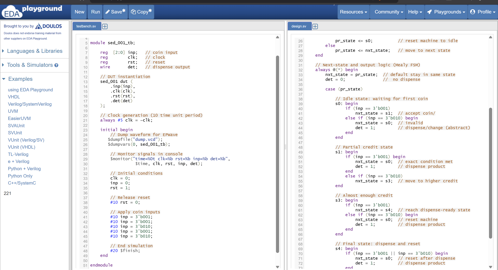

# FSM-Based Vending Machine | RTL Design & Simulation Verification (Verilog)

## Project Overview
This project implements a **Finite State Machine (FSM) based vending machine controller** using **Verilog RTL** and verifies its functionality through simulation.

The vending machine accepts coin inputs and dispenses a product once the required amount is reached. The goal of this project is not only to implement the RTL but also to **demonstrate a structured verification approach** using a Verilog testbench.

This repository highlights **basic verification methodology used in digital design verification** including stimulus generation, monitoring, and result checking.

---

# Design Specification

The vending machine accumulates the value of inserted coins and dispenses a product when the required amount is reached.

### Example FSM States
- `IDLE` – Waiting for coin insertion
- `STATE_5` – 5 units inserted
- `STATE_10` – 10 units inserted
- `STATE_15` – 15 units inserted
- `DISPENSE` – Product dispensed

After dispensing the product, the machine returns to the **IDLE state**.

---

# Inputs

| Signal | Description |
|------|-------------|
| clk | System clock |
| reset | Active reset signal |
| coin | Coin input signal |

---

# Outputs

| Signal | Description |
|------|-------------|
| dispense | Indicates product dispensing |
| change | Indicates return of excess amount |

---

# Verification Strategy

Verification of the RTL design is performed using a **self-checking Verilog testbench**.  
The objective is to ensure that the FSM transitions correctly and produces expected outputs for different input sequences.

The verification approach includes:

- Clock generation
- Reset initialization
- Stimulus generation (coin sequences)
- Output monitoring
- Functional checking

---

# Testbench Architecture

The testbench is organized into the following logical components:

### 1. Clock Generator
A periodic clock signal drives the RTL module.

### 2. Reset Logic
The design is initialized using a reset signal before applying stimulus.

### 3. Stimulus Generator
Different coin insertion sequences are applied to simulate real vending machine usage scenarios.

Example stimulus sequences:
- Single coin insertion
- Multiple coin accumulation
- Exact amount payment
- Reset condition verification

### 4. Monitor
The monitor observes key signals including:
- FSM state transitions
- Output signals (`dispense`, `change`)

### 5. Checker
Outputs are compared with expected behavior to ensure functional correctness.

---

# Verification Scenarios

The following scenarios are verified in simulation:

### Scenario 1 – Reset Verification
Ensure the FSM enters the **IDLE state** after reset.

### Scenario 2 – Coin Accumulation
Verify correct state transitions when coins are inserted sequentially.

### Scenario 3 – Product Dispense
Verify that the **dispense signal is asserted when the required amount is reached**.

### Scenario 4 – State Transition Validation
Ensure FSM transitions follow the defined state diagram.

---

# Simulation Results

Simulation waveforms confirm:

- Correct state transitions
- Proper product dispensing behavior
- Correct reset operation

Example simulation waveform:



---

# Project Structure

```
fsm-vending-machine-rtl-verilog
│
├── vending_machine.v        # RTL design
├── vending_machine_tb.v     # Testbench for verification
├── hisb.png                 # Simulation waveform
├── sdf.png                  # Additional waveform / result
└── README.md
```

---

# Tools Used

- Verilog HDL
- RTL Simulation (ModelSim / QuestaSim / EDA Playground)

---

# Verification Learning Outcomes

Through this project:

- Implemented a **Finite State Machine based RTL design**
- Developed a **Verilog testbench for functional verification**
- Verified **state transitions and output behavior**
- Performed **waveform analysis for debugging and validation**

---

# Possible Future Enhancements

To extend this project toward **industry-level verification**, the following improvements can be implemented:

- SystemVerilog testbench
- Assertion-based verification
- Functional coverage collection
- Constrained random stimulus
- UVM-based verification environment

---

# Author

VLSI Design Verification Engineer  
Focus Areas: RTL Design | SystemVerilog | Functional Verification | UVM
